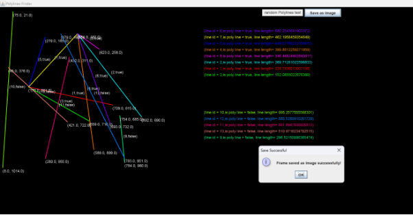

**Overview**

The program is designed to read line segments from a file, identify and group them into polylines based on connectivity rules, sort these polylines by total length, and then visualize them in a graphical interface using Java Swing.

**Components**

1. **LineSegment Class**:
   1. Represents a line segment with properties such as coordinates (x1, y1, x2, y2), length, visited status, polyline identification, connected segment IDs, and line color.
   1. Provides methods to calculate length, check connectivity with other segments, and manage properties.
1. **FindPolyLines Class**:
   1. Loads line segments from a file (input.txt) into an ArrayList<LineSegment>.
   1. Implements a method findPolyline to recursively find and group connected line segments into polylines based on endpoint connectivity.
   1. Sorts polylines by total length and displays them.
1. **PolylinesVisualization Class**:
   1. Extends JPanel to create a custom visualization of polylines.
   1. Calculates scaling factors for graphical representation based on the minimum and maximum coordinates of segments.
   1. Uses distinct colors for each polyline and draws segments on the panel.
   1. Provides functionality to save the visualization as an image.
1. **Main Class**:
   1. Entry point (main method) that initializes FindPolyLines to start the program execution.

**Execution Flow**

1. **Loading Segments**:
   1. Reads line segments from input.txt and initializes LineSegment objects.
   1. Each segment is assigned a unique identifier.
1. **Finding Polylines**:
   1. Uses a recursive approach (findPolyline) to discover connected line segments and form polylines.
   1. Marks segments as visited once they are added to a polyline.
1. **Sorting Polylines**:
   1. Sorts discovered polylines based on their total length in descending order.
1. **Visualization**:
   1. Creates a Swing JFrame and embeds a custom PolylinesVisualization panel.
   1. Displays polylines with segments drawn using calculated coordinates and scales.
1. **User Interaction**:
   1. Provides options like displaying polylines sorted by length, saving the visualization as an image, and generating random tests for polylines.

**Technical Details**

- **Data Structures**:
  - Uses ArrayList to store line segments and polylines.
  - Utilizes Comparator to sort polylines based on length.
  - Manages graphical elements using Graphics2D for drawing segments and text.
- **Visualization Customization**:
  - Implements color coding for different polylines.
  - Calculates coordinates based on screen resolution and segment positions.

**Conclusion**

The program effectively reads, processes, visualizes, and interacts with polyline data, offering functionality to explore and manipulate polylines both from file input and randomly generated tests. It leverages Java's Swing library for GUI components and ensures efficient management and display of graphical elements representing polylines.

